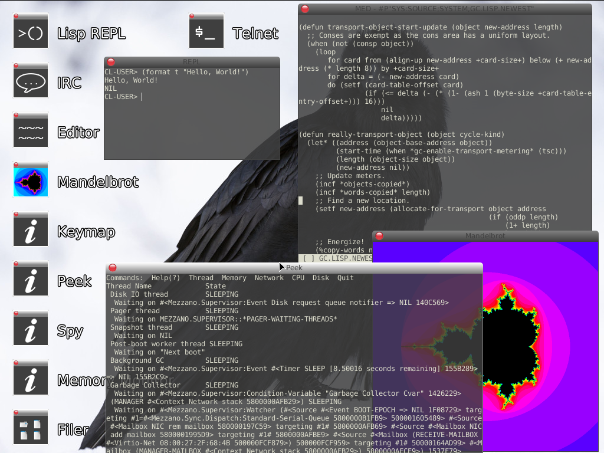

# Mezzano, an operating system written in Common Lisp.

## Pre-built images

Demo releases are available through [GitHub](https://github.com/froggey/Mezzano/releases).

These releases are designed to be run in VirtualBox, though QEMU is also supported.
2GB of RAM, a virtio-net NIC and an Intel HDA audio controller are recommended.
For instructions on getting started and using Mezzano, please see our [User Documentation](doc/manual.md).

x86-64 images are published.  AArch64 has been made to work on some
hardware.  But to set expectations: making Mezzano run on any given
piece of hardware or emulator is still typically a project that
requires the user to dig into the code.

## Documentation

Comprehensive user documentation, including a getting started guide, user manual, FAQ, and tutorials, can be found in the [doc/manual.md](doc/manual.md) file, which serves as the main entry point for our documentation.

## Building from source

See the MBuild repo: (https://github.com/froggey/MBuild)

For help & support or to follow development, join the #mezzano IRC channel on Libera Chat (irc.libera.chat)

## Major changes since Demo 4

* USB stack by fittestbits
* Improved overall file system support by fittestbits
* EXT2/3/4 support has been implemented by Bruno Cichon (ebrasca)
* GMA950 modesetting display driver
* Hardware accelerated 3D support via qemu's Virgl device
* Multicore/SMP support
* Improved atomic operations
* Async APIs: wait-for-objects, dispatch, and thread pools
* Networking improvements: Server support, DHCP, TCP retransmit
* Source locations are tracked for many kinds of definitions
* Weak hash tables and other weak objects
* Cleanup of object representation and unifcation of standard-object/structure-object
* Unboxed structure slots
* Short floats implemented using IEEE half floats
* Unboxed (unsigned-byte 64) arithmetic
* Stack overflows and memory faults are trapped and can be recovered from
* Support for building on Windows
* Major improvements to CLOS and MOP conformance
* Keymap picker
* More bug fixes, performance improvements and features

## Major changes since Demo 3

* FAT32 support has been implemented by Bruno Cichon (ebrasca).
* McCLIM has been ported by fittestbits.
* Quicklisp has been ported by Peter S. Housel.
* Improved introspection tools: DISASSEMBLE and ED have been implemented.
* Generational collection has been added to the garbage collector.
* New SSA-based compiler backend, supporting unboxed value representations.
* Gray streams support has been overhauled.

## Major changes since Demo 2

* Trentino, a media player, has been implemented by Eugene Zaikonnikov.
* Further improvements to conformance, stability and performance.
* The CLOS implementation follows the MOP much more closely.
* More traditional window management.
* Booting from CD/USB on real hardware is now possible.
* Driver support for Intel HDA audio devices.
* VirtualBox guest (mouse & display) integration.

## Major changes since Demo 1

* Many improvements to conformance, stability and performance.
* The editor has been greatly improved, thanks to Burton Samograd.
* The system now functions correctly on computers with more than 1GB of RAM.
* The allocator and garbage collector now make much better use of available memory, with far fewer GC cycles occuring.
* (ROOM T) prints more detailed information about allocated objects.
* Transparency and premultiplied alpha support in the GUI.
* And more!

## Additional information

"Hypothymis azurea - Kaeng Krachan" by JJ Harrison (jjharrison89@facebook.com)
[CC BY-SA 3.0 (http://creativecommons.org/licenses/by-sa/3.0)], via Wikimedia Commons
https://commons.wikimedia.org/wiki/File:Hypothymis_azurea_-_Kaeng_Krachan.jpg

"Mandarin Pair" by © Francis C. Franklin / CC-BY-SA-3.0.
Licensed under CC BY-SA 3.0 via Wikimedia Commons - http://commons.wikimedia.org/wiki/File:Mandarin_Pair.jpg

"Handsome" by Andy Morffew - https://www.flickr.com/photos/andymorffew/19377769093/in/album-72157630893775092/
[CC BY 2.0 (http://creativecommons.org/licenses/by/2.0)]

Includes Dejavu Fonts 2.37 (https://dejavu-fonts.github.io/)

Some icons from Icojam (http://www.icojam.com)
